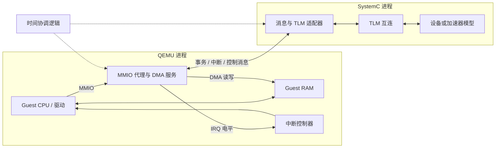
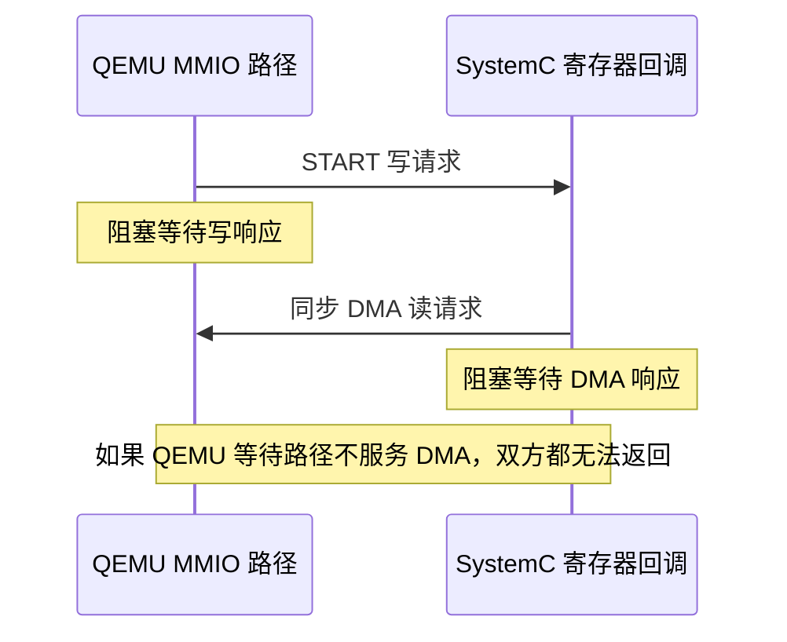
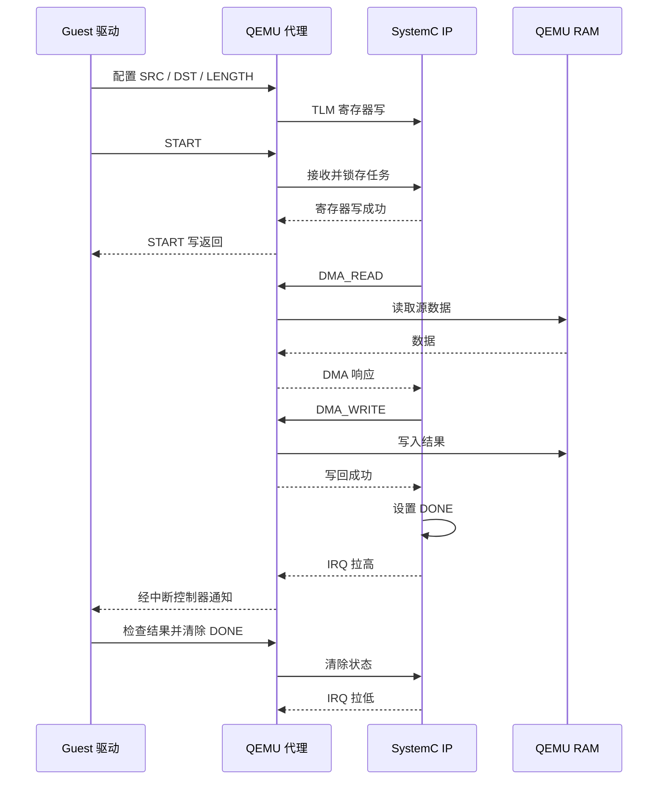

# QEMU 与 SystemC 联合仿真：ESL 建模设计方案

## 1. 目标与结论

本文面向电子系统级（ESL）建模，设计将 QEMU 中的软件执行环境与 SystemC/TLM-2.0 硬件模型连接起来的方法。

建议从以下分工开始：**QEMU 执行 CPU 指令、运行软件并维护主存；SystemC 实现待研究的外设或加速器；桥接层传递 MMIO、DMA、中断和同步消息。** 首先完成事务级功能验证，再增加受控的时间推进，最后才优化通信性能。

默认实验平台沿用 [QEMU 学习路线](QEMU_LEARNING_DESIGN.zh-CN.md)：RISC-V 64、virt、单 vCPU、TCG。该选择用于缩小首版范围，不代表现有 Xilinx 示例可以直接用于此平台。

本文是本地研究与实验设计，尚未实现或运行联合仿真。遵循 [QEMU 代码来源政策](../docs/devel/code-provenance.rst)，本文及 AI 生成的实验内容不用于 QEMU 上游贡献。

阅读顺序：第 4～5 节确定两端职责和访问路径；第 6 节解决双向通信的推进与死锁问题；第 7 节说明时间同步及其精度边界；第 11～12 节给出实施和验证方法。本文中的 SC 指 SystemC。

设计应同时满足三类正确性：**事务语义正确、通信能够持续推进、模拟时间符合因果关系。** socket 连通只能证明字节可以传输，不能代替这三类验证。

## 2. 建模范围与精度边界

### 2.1 可以回答的问题

- Guest 驱动能否正确配置硬件寄存器？
- 加速器是否按照约定读取输入、写回结果并产生中断？
- 给定设备延迟和总线模型时，软件与设备如何交互？
- 调整缓冲区、DMA 分块和设备队列深度后，模型中的吞吐量如何变化？

### 2.2 必须明确的限制

QEMU TCG 提供指令功能执行；`icount` 将指令计数映射到虚拟时间，并不模拟真实 CPU 的流水线、缓存缺失、乱序执行或指令周期。因此本方案不能直接给出真实 CPU 的周期数或完整 SoC 的精确性能结论。参见仓库 [TCG instruction counting](../docs/devel/tcg-icount.rst)。

默认 QEMU RAM 访问不会逐次经过外部 SystemC 总线模型。首版能观察转发的 MMIO 和显式 DMA 事务，不能声称覆盖全部 CPU 取指、load/store 或缓存一致性流量。如果研究目标是 CPU—cache—NoC—DRAM 的详细性能，需要另行设计访存集成，或评估专用时序模拟器。

所有性能报告必须写明：CPU 时间假设、SystemC 模型精度、同步策略、量子大小以及哪些路径被绕过。

## 3. 当前仓库与方案选择

### 3.1 本地检查结果

当前仓库 `VERSION` 为 `11.1.50`。在 `hw/`、`include/`、`docs/` 和构建选项中检索 SystemC、TLM 和 Remote-Port，未找到可直接使用的通用 SystemC 联合仿真桥。Xen 代码中的 `remote_port` 名称属于其他机制。

可复用的内部接口包括：

| 能力 | 源码入口 | 桥接用途 |
| --- | --- | --- |
| MMIO | `include/system/memory.h`、`system/memory.c` | 将指定地址窗口的访问转换为事务 |
| DMA | `include/system/dma.h` | 从设备视角访问 QEMU 管理的内存 |
| 地址空间 | `include/system/address-spaces.h` | 确定设备访问哪一个地址空间 |
| 开发板接线 | `hw/riscv/virt.c` | 分配地址、连接中断、描述设备 |
| 虚拟时间 | `accel/tcg/`、`system/` | 调查执行预算、定时器与外部事件同步 |

这些接口是实现基础，不是现成的跨进程联合仿真 API。

### 3.2 可选连接方案

| 方案 | 优点 | 成本或限制 | 适用场景 |
| --- | --- | --- | --- |
| Xilinx QEMU + libsystemctlm-soc / Remote-Port | 有现成桥接框架和示例 | 必须匹配 QEMU 分支、板级适配、协议版本 | 优先验证已有平台的联合仿真 |
| 当前 QEMU + 自定义代理设备 + SystemC 适配器 | 地址空间与目标设备可自行定义 | 需实现协议、线程交接、复位和同步 | 保留当前 RISC-V 平台开展本地研究 |
| 将 QEMU 和 SystemC 放入同一进程 | 有机会降低 IPC 开销 | 生命周期、线程、ABI 与双调度器耦合复杂 | 已有成熟集成框架时 |

[libsystemctlm-soc](https://github.com/Xilinx/libsystemctlm-soc) 提供连接 Xilinx QEMU 与 SystemC 的代码；[示例项目](https://github.com/Xilinx/systemctlm-cosim-demo) 可用于理解连接方式。采用这条路线时，先固定各仓库提交并复现其支持的示例，再判断如何适配目标平台。

**本仓库的建议设计采用两个进程和显式消息桥。** 可复用 Remote-Port，但必须移植其 QEMU 端设备与板级连接，不能仅安装 SystemC 库就让当前 QEMU 支持它。下文的消息名是自定义桥的设计约定，不是 Remote-Port 的实际线格式。

## 4. 总体结构与职责



时间协调逻辑可以位于桥接器内部，不要求第三个进程。

| 组件 | 负责内容 | 权威状态 |
| --- | --- | --- |
| QEMU | CPU、Guest 软件、主存、平台设备、中断控制器 | CPU 状态、RAM 内容 |
| QEMU 代理 | 地址转换、事务封装、DMA 服务、中断注入 | 连接状态、事务 ID、IRQ 镜像 |
| SystemC 适配器 | 消息解码、TLM 调用、事件回传 | TLM 事务生命周期 |
| SystemC IP | 寄存器语义、运算、设备内部调度 | 寄存器、BUSY/DONE、结果状态 |
| 时间协调逻辑 | 时间授权、同步点、未来事件约束 | 已确认的共同时间边界 |

寄存器逻辑只在 SystemC 中维护，避免两端各实现一套状态后产生分歧。QEMU 代理可保存连接和 IRQ 状态，但不要擅自缓存具有副作用的设备寄存器。

## 5. 四类连接路径

### 5.1 CPU 访问设备：MMIO 到 TLM

路径：Guest load/store → QEMU MMIO 代理 → IPC → SystemC 桥的 TLM initiator socket → IP target socket。

QEMU 端使用 `memory_region_init_io()` 注册窗口，通过 `MemoryRegionOps` 接收访问。需要报告访存错误时，应考虑带 `MemTxResult` 返回值的 `read_with_attrs` / `write_with_attrs`，并核对目标架构的错误处理行为。

SystemC 桥接侧作为发起方，IP 寄存器模块作为目标方。首版采用 Loosely Timed（LT）和 `b_transport`；暂不引入非阻塞四阶段协议。

| QEMU / 消息信息 | TLM 表达 | 设计要求 |
| --- | --- | --- |
| 读或写 | command | 使用对应读写命令 |
| 窗口内偏移 | address | 明确使用偏移还是系统绝对地址 |
| 访问宽度 | data length | 首版寄存器只允许对齐的 32 位访问 |
| 数据字节 | data pointer | 按约定字节序序列化，不传宿主指针 |
| 连续访问 | streaming width | 首版等于 data length |
| 字节使能 | byte enable | 首版全字节有效，其他形式拒绝 |
| 处理结果 | response status | 将地址和命令错误映射回桥接状态 |
| 模型延迟 | delay | 由时间协调层处理，避免重复计时 |

TLM payload 的这些字段可参见 [Accellera 参考实现](https://github.com/accellera-official/systemc/blob/main/src/tlm_core/tlm_2/tlm_generic_payload/tlm_gp.h)。不要跨进程序列化 C++ 对象本身，数据缓冲区应保持有效直到事务完成。

普通 QEMU MMIO 回调在返回前需要得到读值或写入结果，不能先返回“处理中”再异步补上读值。因此必须设计同步等待期间的消息处理与锁策略。

还应区分“总线访问完成”与“设备任务完成”：START 寄存器写成功表示命令被接收，DMA 和运算可以稍后完成。读清除、写一清除（W1C）、门铃等寄存器不得被桥接器缓存、合并或自动重试。

在 [MemoryRegionOps 定义](../include/system/memory.h) 中，`valid` 描述 Guest 可用的访问约束，`impl` 描述实现支持的宽度。只设置实现宽度可能使一次访问被拆成多次回调；对于具有副作用的寄存器，必须核对这种拆分是否改变行为。首版应显式拒绝不支持的宽度、非对齐访问和跨寄存器访问，而不是任意拆分。

### 5.2 设备访问主存：DMA 反向通路

路径：SystemC IP initiator → SystemC 桥 target → DMA 消息 → QEMU 的设备地址空间 → Guest RAM。

首版由 QEMU 持有 RAM，SystemC 通过桥进行 DMA 读写。QEMU 侧使用设备对应的 `AddressSpace` 与 `dma_memory_read()` / `dma_memory_write()` 等接口。

首版不启用 IOMMU：驱动传入的设备地址按约定解释为 Guest 物理地址。后续启用 IOMMU 时，需要接入设备 DMA 地址空间，不能继续把 IOVA 直接当 Guest 物理地址。

必须校验地址加长度的溢出、合法 RAM 范围和最大传输长度；首版拒绝 DMA 到 MMIO 及桥自身窗口，避免递归访问。DMA 分块上限由握手协商，日志记录块序号。

完成顺序固定为：**输出数据写回成功 → 设置 DONE → 产生完成中断。** DMA 失败时进入设备错误状态，不产生“成功完成”。

### 5.3 设备通知 CPU：中断反向通路

路径：SystemC IRQ 变化 → 带顺序信息的消息 → QEMU 代理 → 板级中断控制器输入 → Guest CPU。

首版选用电平中断。SystemC 同时发送拉高和拉低，QEMU 在适当的执行上下文中通过 `qemu_set_irq()` 等机制更新线状态。Guest 清除状态位后，由 SystemC 更新寄存器并发出撤销中断消息。

RISC-V virt 的具体控制器配置必须固定，例如使用 PLIC；不能将设备 IRQ 直接等同于 CPU 中断号。设备树中的中断描述、控制器输入线和驱动绑定必须一致。

### 5.4 控制与生命周期

连接顺序：SystemC 建立监听 → QEMU 代理连接 → 握手校验 → 对齐初始状态 → 允许 Guest 运行。

复位流程：暂停新请求 → 取消或完成旧事务 → 两端复位 → IRQ 撤销 → 确认新 epoch → 恢复运行。旧 epoch 的响应不能作用于复位后的设备。

设备复位通常不清除 Guest RAM，也不撤销已完成的 DMA 写入。复位规范必须区分“尚未提交的事务被取消”和“已提交的内存副作用保留”，并阻止旧任务在复位确认后继续提交写入。不能仅靠丢弃旧响应实现这一点。

首版断连或超时应将实验标记为失败，终止相关等待并输出事务和时间诊断信息。不要静默返回成功，也不要重连后重放可能有副作用的写操作。暂停、复位、退出都需要两端协调；首版不支持联合快照和迁移。

## 6. 通信与线程设计

### 6.1 首版传输与消息

建议同机使用 Unix domain socket，固定线格式、长度和字节序，处理短读、短写和断开连接。宿主墙钟超时仅用于检测挂起，不代表模拟时间流逝。

自定义协议的公共字段：`version`、`type`、`length`、`epoch`、`transaction_id`、`device_id`。需要定时的消息增加整数时间戳和序号；握手统一时间单位和精度。

| 消息类别 | 方向 | 主要内容 |
| --- | --- | --- |
| HELLO / CONFIG | 双向 | 版本、能力、时间单位、地址窗口、传输上限 |
| MMIO_REQ / RESP | QEMU 发起 | 偏移、宽度、数据、状态 |
| DMA_REQ / RESP | SystemC 发起 | 地址、长度、数据、状态 |
| IRQ_UPDATE | SystemC 发起 | 线编号、电平、序号、适用时间 |
| TIME_REQUEST / GRANT | 协调层 | 请求边界、可安全推进边界 |
| RESET / ACK、STOP | 双向 | epoch、事务处置、退出原因 |

首版只允许一个 CPU MMIO 请求在途，但要能区分并处理反向 DMA、中断和控制消息。相同 ID 的请求与响应必须匹配，两个方向的 ID 空间应可区分。

若采用 Remote-Port，应直接遵循其实现和 [协议文档](https://github.com/Xilinx/libsystemctlm-soc/blob/master/docs/remote-port-proto.md)，不要把上述自定义消息混入其现有协议。

### 6.2 事务身份、确认与生命周期

使用 `(epoch, origin, transaction_id)` 标识事务，避免两个方向恰好使用相同 ID。事务类型、设备和响应长度也要验证，不能只按 ID 接收任意返回包。

```text
CREATED → QUEUED → SENT → WAIT_RESPONSE → COMPLETED
                        └──────────────→ FAILED / CANCELLED
```

首版约定一个 MMIO 请求和一个 DMA 请求分别在途；两者可以同时存在。后续提高并发度时，显式增加额度，而不是默认远端能够无限接收请求。

确认的含义必须区分：

| 确认层次 | 能证明什么 | 不能证明什么 |
| --- | --- | --- |
| socket 发送成功 | 字节交给了本地传输层 | 对端已经处理请求 |
| MMIO 响应成功 | 本次寄存器访问按规范完成 | 整个加速任务已经结束 |
| DMA 写响应成功 | 写入在约定可见时间已提交 | Guest 已收到完成中断 |
| DONE / IRQ | 满足任务完成条件 | Guest 驱动已经消费结果 |

超时后不能假定事务“没有执行”：可能是远端已执行而响应丢失。首版不自动重试有副作用的事务；未知或重复响应作为协议错误处理，已明确失效的旧 epoch 响应丢弃并记录。

### 6.3 线程职责与消息分派

推荐把字节收发、事务分派和模型执行分开设计。下表是职责划分，不要求每行对应独立宿主线程。

| 执行角色 | 负责工作 | 约束 |
| --- | --- | --- |
| 两侧传输线程或事件处理器 | 读写 socket、组帧、校验长度、入队 | 不直接修改模型状态，不持队列锁调用模型 |
| QEMU 设备服务上下文 | DMA、IRQ、设备复位 | 按 API 要求处理 BQL、对象生命周期和地址空间 |
| QEMU MMIO 调用路径 | 发起事务并等待匹配响应 | 等待时必须保留必要的反向服务能力 |
| SystemC 桥接进程 | 将收到的事务转换为 TLM 调用 | 运行在 SystemC 内核管理的上下文中 |
| SystemC 设备执行进程 | 运算、DMA、完成事件 | 等待 DMA 时让出调度，不阻塞整个内核 |

`SC_THREAD` 是仿真进程，不等同于一个独立的操作系统线程。在其中执行阻塞 socket 读取可能阻塞整个仿真调度线程。需要独立传输层和可靠的跨线程通知，或经过验证的可重入消息泵。

宿主线程入队后，应通过框架支持的机制唤醒模型执行上下文。SystemC 侧不能假定普通线程可直接调用 `wait()` 或任意内核事件；QEMU 侧也不能假定所有设备接口都支持无锁跨线程调用。QEMU 上下文与 BQL 的关系参见 [多 IOThread 文档](../docs/devel/multiple-iothreads.rst)。

### 6.4 三类典型死锁

**场景 A：同步 MMIO 中嵌套 DMA。**



处理方式：START 回调只锁存参数并确认接收；设备执行由后续仿真进程推进。协议应避免要求在确认 START 前先完成 DMA。

**场景 B：持有 BQL 等待另一个 QEMU 上下文。**

vCPU 的 MMIO 路径持有 BQL 并等待远端响应，远端又等待 DMA 服务，而安排执行 DMA 的主循环或其他上下文需要同一把锁。即使接收线程已经收到消息，任务也不能执行。

处理方式：逐项画出锁与等待依赖。候选方案是由已具备正确上下文的等待路径服务受限 DMA 请求，或在明确支持释放锁和恢复状态的边界交接工作。不能在任意 MemoryRegion 回调中自行释放 BQL；也不能未经验证就递归运行整个 QEMU 主循环。

**场景 C：SystemC 等待期间堵住模型调度。**

SystemC 设备等待 DMA 返回时，如果直接阻塞承载内核的宿主线程，桥接进程就不能处理 Guest 发来的 STATUS 读，可能形成新的循环等待。

处理方式：设备进程等待可由消息到达唤醒的仿真事件，桥接分派继续工作。注册响应等待项应早于请求发送，等待必须检查完成条件，防止快速响应导致丢失唤醒。

### 6.5 等待期间如何保持推进

同步 MMIO 的等待不应等价于“只读下一条响应”。建议按以下职责组织等待逻辑；这是设计流程，不是可直接调用的 QEMU API：

1. 发请求前登记等待项并保留事务缓冲区。
2. 收到匹配响应，记录结果并满足完成条件。
3. 收到反向 DMA，交给具备正确上下文的受限服务路径；校验其模拟时间，不提前提交未来数据。
4. 收到 IRQ，先登记事件，在允许的模拟时刻注入。
5. 收到同步、复位、退出或断连消息，按当前状态机推进或终止等待。
6. 没有可处理工作时才等待通知；不持有通信队列锁等待远端。

受限服务路径只允许访问约定 RAM 区间，不递归进入代理 MMIO，也不任意执行热插拔、销毁设备等操作。复位可先登记为待协调事件，再在安全边界生效。

队列锁只保护入队、出队和等待表更新；取出消息后释放锁，再调用模型或设备接口。若 QEMU 工作需要 BQL，不应持有队列锁等待 BQL，否则容易与持 BQL 的 MMIO 路径形成锁顺序反转。

### 6.6 背压、公平性与顺序

为请求队列和在途事务设置容量。远端忙时停止接收新的业务请求或返回约定的忙状态，但必须保留完成响应、复位和同步消息的处理能力。

单 socket 双向传输可以满足首版要求。大 DMA 包仍可能阻塞同方向后续控制消息，因此应限制分块长度；后续若拆分控制与数据通道，需要显式维护跨通道顺序，不能依赖消息到达先后。

优先服务控制消息不等于任意重排业务事件。DMA 写入、DONE 更新和 IRQ 必须保留依赖关系；IRQ 拉高与拉低也不能被当作普通缓存状态随意合并。

首版关闭 posted write，寄存器写逐次确认。若后续引入 posted write，必须补充 fence、错误报告和读后写排序规则。

## 7. 时间同步设计

### 7.1 同步目标与时间定义

时间同步解决的是：**双方可以安全推进到哪里，以及一个跨端事件何时对接收方可见。** 不要求两个宿主进程运行速度相同，也不要求两端时间在任意瞬间相等。

| 符号 | 含义 | 注意事项 |
| --- | --- | --- |
| `T_wall` | 宿主墙钟时间 | 只用于执行耗时和挂起检测 |
| `T_q` | QEMU 虚拟时间 | Guest 定时器等使用的时间基础 |
| `T_sc` | SystemC 内核时间 | 对应 `sc_time_stamp()` |
| `Δ_local` | 某个 TLM 发起方的本地时间偏移 | 不代表整个 SystemC 系统都已推进 |
| `T_eff` | 该发起方的有效逻辑时间 | `T_eff = T_sc + Δ_local` |
| `Q` | 同步量子 | 限制局部推进范围，不是硬件时钟周期 |

socket 耗时不能作为设备延迟，宿主 `sleep()` 不能代替模拟时间推进。即使双方都以 ns 表示时间，也要统一原点、分辨率、时间戳含义和换算舍入规则。

首版时间戳使用统一单位的整数 tick，握手确认 tick 长度；检查转换溢出。精度不足时，采用有记录的舍入规则，不能把提前注入事件当成无影响的误差。

### 7.2 先区分三种精度目标

| 模式 | 承诺 | 适用目标 |
| --- | --- | --- |
| F：功能连通 | 事务结果与功能顺序正确，不承诺跨端时间精度 | 驱动、寄存器、DMA、中断功能验证 |
| LT：受约束的松散定时 | 采用明确的量子和提前运行策略，报告偏差与限制 | 有边界条件的设备与软件时序研究 |
| T：保守因果协调 | 按所定义时间模型，不提交早于已执行历史的外部事件 | 对事件次序有严格要求的实验 |

本方案先完成 F，再以 T 为自定义同步设计目标；采用现有 LT 框架时，应按其实际保证报告精度，不能仅因有 SYNC 消息就称为严格保守同步。T 保证的是所建模型的因果关系，仍不等于真实 CPU 周期精确。

功能模式允许 SystemC 独立验证内部延迟，但跨模拟器端到端延迟不作为性能结论。严格模式遇到无法处理的迟到事件应报告失败，而不是把时间戳钳位到“现在”后继续声称精确。

### 7.3 时间不同步会造成什么问题

假设 QEMU 已到 1000 ns，SystemC 在处理 500 ns 的状态时产生了应在 600 ns 生效的 IRQ。此时直接注入会造成 400 ns 的迟到；修改 QEMU 时钟不能撤销已经执行的指令和内存写入。

需要回滚才能修复已提交的历史，而本方案不提供回滚。因此，应在执行前限制推进范围，使事件在对端越过其生效时刻前被交付或纳入调度。

同样，SystemC 不能先不可撤销地处理到 200 ns，再收到 QEMU 在 130 ns 的寄存器写并假装它发生在正确时刻。同步必须约束两个方向。

### 7.4 事务同步与周期同步

**事务同步**在 MMIO、DMA、中断等交互点传递时间和依赖关系。阻塞读除了返回数据，还需要定义请求何时生效、读值何时采样、完成时间是什么。

例如，一个模型规定寄存器读于 100 ns 发起、120 ns 完成并在完成时采样，那么 QEMU 不得在 120 ns 前继续执行依赖读值的指令。桥必须同时保证返回的读值符合 120 ns 的模型状态，不能先读出 100 ns 的值再简单附加 20 ns 延迟。

**周期同步**处理没有设备访问的区间。QEMU 在纯计算循环或 WFI 中仍需与 SystemC 协调，不能只靠下一次 MMIO 才检查外部事件。

```text
事务同步：发生跨端访问 → 核对逻辑时间 → 处理与完成
周期同步：到达授权边界 → 交换安全推进信息 → 获得下一段授权
```

二者互补。每次事务带时间戳，并不能阻止两次事务之间跑得过远；周期性握手也不能自动修复周期内已经错误排序的事件。

### 7.5 安全边界、量子与 lookahead

协调器向每一端授予推进边界 `H`。授予的依据不仅是“目前已知下一个事件在何时”，还包括对端能承诺的**未来输入时间下界**。

设当前时间为 `t`、本地需处理的下一事件为 `E_local`、对端保证不会早于 `L_peer` 产生新的相关输入，则本轮边界可受以下条件限制：

```text
H ≤ min(t + Q, E_local, L_peer)
```

这是边界约束，不是完整调度算法。到达边界时要处理本地事件或重新协调；若可能存在时间恰为 `H` 的输入，在这些事件归并前不能提交依赖其排序的 `H` 时刻操作，也不能越过 `H`。

`L_peer` 必须包含对端执行产生新事件的可能性，以及尚在传输中的消息。CPU 可能在 130 ns 发出尚未发现的 MMIO，所以“当前只知道 160 ns 有一个设备定时器”不能证明两边都能自由运行到 160 ns。

lookahead 是对最早未来影响的有效保证，通常依赖模型明确的最小延迟或执行限制。不能为了提高速度任意声明一个正值；零延迟 MMIO 反馈可能使 lookahead 为零。

没有正 lookahead 时，需要更细粒度的执行交接或经过验证的串行协调。单纯轮流让两个模拟器各跑一个量子仍不充分。严格实现必须给出“为什么这个边界内不会出现未处理的更早输入”的依据。

### 7.6 一次带时序任务的完整例子

以下是模型约定下的示例时间线，不表示现有 QEMU 已具备这些调度能力。假设 CPU 在 START 后进入 WFI，且协调器已确认这段空闲期间不存在其他更早的跨端输入。

| 模拟时刻 | QEMU 侧 | SystemC 侧 | 同步要求 |
| --- | --- | --- | --- |
| 100 ns | 发起 START 写 | 接收任务 | 两端同意请求生效时刻 |
| 110 ns | 写响应可见，随后进入 WFI | 任务已排入执行流程 | 寄存器访问完成不等于任务完成 |
| 120 ns | 为 DMA 读提供该时刻的数据 | 发起输入 DMA | 地址空间与采样时刻一致 |
| 180 ns | 输出 DMA 在该时刻提交 | 等待写回确认 | 不允许未来数据提前进入可读 RAM |
| 180 ns 后的约定事件阶段 | 登记 IRQ，唤醒 CPU | 更新 DONE 并拉高 IRQ | 先写回，后状态，再中断 |
| 后续时刻 | 驱动读取结果并清状态 | 撤销 IRQ | 中断结束也需要传播 |

同一时间戳内部需保留数据依赖顺序，可使用模拟阶段或 delta-cycle 规则。不能用两个接收线程谁先拿到包来决定先写数据还是先发中断。

### 7.7 QEMU 侧：执行预算、MMIO 等待与空闲推进

固定 `icount` 模式可以把指令执行映射到虚拟时间。例如 `shift=N` 对应每条指令 `2^N` ns 的配置含义，具体见 [启动选项源码](../qemu-options.hx)。这不是实际 CPU 的 IPC 或周期模型。

仓库 [icount 文档](../docs/devel/tcg-icount.rst) 说明：执行预算会受下一定时器期限约束，MMIO 路径会处理指令计数，使访问处的时间可被正确获得。它提供了时间集成基础，但没有自动建立与 SystemC 的授权协议。

QEMU 集成至少需要解决：

1. 将外部授权边界接入执行预算或适当的虚拟定时器机制，使 vCPU 在边界处退出执行。
2. 在 MMIO 发起位置捕获模拟时间，等待期间保留反向服务能力。
3. 将读响应的延迟落实为 Guest 可观察的执行约束；不能仅阻塞宿主线程，也不能私自修改全局时钟字段。
4. 按模拟时间登记外部 IRQ 和 DMA 提交，而不是消息一收到就生效。
5. CPU 空闲时继续推进到安全的外部事件边界，并完成唤醒。

这里第三项需要专门验证：读回调必须返回数据，而等待期间的 QEMU 虚拟时间、定时器和设备服务如何继续推进，需要与执行循环共同设计，单独添加一个代理设备未必足够。

`icount` 的 `sleep=off` 可使空闲虚拟时间跳到下一定时器期限，但 SystemC 事件若尚未纳入协调，仍可能被跳过；`align` 处理的是与宿主墙钟的关系，也不是与 SystemC 的同步。当前文档说明 icount 不兼容多线程 TCG，首版保持单 vCPU、单线程 TCG。

### 7.8 SystemC 侧：delay、局部时间与模型可见性

LT 模型可以在 `b_transport` 内消耗时间，也可以用 `delay` 标注时间；接口必须规定进入和返回时 delay 的含义，防止同一段时间被重复计算。

`tlm_quantumkeeper` 管理单个发起方的局部时间偏移，在同步时将相应等待落实到 SystemC 内核；它不会自动暂停或推进外部 QEMU。参见 [Accellera quantum keeper 实现](https://github.com/accellera-official/systemc/blob/main/src/tlm_utils/tlm_quantumkeeper.h)。

标注时间不等于自动延迟状态更新。例如模型立即修改 DONE，再返回“延迟 100 ns”，其他观察者可能过早看到 DONE。对于跨模拟器可见的状态，应在约定时刻提交，或证明局部提前执行期间不存在提前观察者。

采用时间解耦时，日志既记录 `sc_time_stamp()`，也记录相关发起方的有效逻辑时间；不要把两者混成一个“SC 当前时间”。同一 tick 内的零延迟事件还要有稳定的排序与收敛条件，避免无限 delta-cycle 反馈。

### 7.9 Remote-Port 的参考机制与适用边界

核对的 [Remote-Port SystemC 实现](https://github.com/Xilinx/libsystemctlm-soc/blob/master/libremote-port/remote-port-tlm.cc) 在同步、内存和信号处理点进行时间记账，并使用 quantum keeper 协调局部时间。信号更新还涉及零时间等待，使变化能被后续仿真过程观察。

该实现的 loosely timed 同步路径明确存在并行运行与时间偏差的折中。因此可参考其机制，但不能据此宣称任意 QEMU 分支、量子与设备组合都严格保守同步；需连同匹配的 QEMU 端一起验证。

### 7.10 量子选择与时间异常诊断

量子应相对于需要分辨的设备交互间隔选择。可用 10 ns、100 ns、1 μs 等参数做敏感性实验，记录结果、事件次序和墙钟开销；这些是候选参数，不是普适推荐值。

| 现象 | 可能原因 | 排查动作 |
| --- | --- | --- |
| IRQ 时间戳早于 QEMU 已提交时间 | 提前运行失控或传输中事件未计入边界 | 检查授权、lookahead 与消息序号 |
| 时间不前进，双方都在等 | 零 lookahead、响应依赖或锁死锁 | 同时查看时间授权和事务等待图 |
| Guest 看见未来 DMA 数据 | 数据在消息到达时立即写入 | 分离消息接收与定时提交 |
| WFI 后不再醒来 | 外部事件未驱动空闲同步 | 验证定时器登记和事件唤醒路径 |
| 改小量子后结果变化 | 时序误差、提前状态可见或竞争 | 对照细粒度基准逐事件定位 |
| 同一配置结果不稳定 | 宿主调度决定模拟排序 | 使用确定的事件排序和输入记录 |

量子减小后的结果收敛是有用证据，但不是因果正确性的证明；仍需检查授权依据和各类事件的提交时刻。

## 8. 内存所有权与优化顺序

### 8.1 第一版：消息 DMA

主存仅由 QEMU 持有，所有外部 DMA 经受控接口访问。这样容易验证地址范围、返回状态及数据先于中断可见的关系。

Guest 驱动必须遵循对应 OS 的 DMA API 和内存屏障规则。QEMU 的普通 RAM 访问不能证明真实硬件的非一致性缓存行为；如需缓存一致性建模，另立模型和验收范围。

CPU 和 DMA 访问同一缓冲区时，首版采用明确的所有权交接：CPU 准备输入后提交任务；设备 BUSY 期间软件不修改输入或消费输出；设备完成后将缓冲区交还软件。这是实验约束，不是桥接器已经实现了硬件缓存一致性协议。

若允许 CPU 与 DMA 并发访问同一范围，需要另外定义读写竞争、DMA 分块之间的可见性以及部分失败语义。大块 DMA 不应被默认视作整个块原子完成；任务中途失败时，已写入的前缀可能保留，必须向软件报告。

### 8.2 第二版：共享内存

确认 IPC 拷贝构成主要瓶颈后，再考虑共享 RAM。需要共同定义 Guest 物理地址到共享文件偏移的映射、有效范围、所有权、访问顺序和同步事件。

共享文件能使双方看到相同字节，不会自动提供模拟时间一致性，也不会自动处理 QEMU 脏页追踪、代码翻译失效和迁移语义。初步优化应限制在约定的 DMA 数据缓冲区，避免直接让外部进程改写可执行 Guest 代码。

### 8.3 DMI 的限制

TLM DMI 指针只在其所在进程地址空间有效，不能作为 IPC 数据直接传给 QEMU。可以在 SystemC 内部使用 DMI，跨进程则需要独立的共享内存映射和失效协议。

DMI 或共享内存绕过事务路径后，可能同时绕过时序、统计和监测逻辑；必须明确哪些访问仍被建模。

## 9. 最小验证设备

建议实现一个内存拷贝加速器：Guest 设置源地址、目的地址、长度并写 START；SystemC 发起 DMA，完成拷贝后更新状态并产生中断。

以下寄存器为建议实验规范，当前仓库中不存在此设备。寄存器窗口大小建议 4 KiB；基地址 `B` 与 IRQ 号在核对板级地址表后分配，本文不预设一个所谓通用空闲地址。

| 偏移 | 名称 | 语义 |
| --- | --- | --- |
| `0x00` | ID | 只读，实验设备标识 |
| `0x04` | CTRL | bit 0 为 START，写 1 提交 |
| `0x08` | STATUS | BUSY、DONE、ERROR，完成状态写 1 清除 |
| `0x0c` | IRQ_ENABLE | bit 0 允许完成或错误中断 |
| `0x10` / `0x14` | SRC_LO / SRC_HI | 源地址低、高 32 位 |
| `0x18` / `0x1c` | DST_LO / DST_HI | 目的地址低、高 32 位 |
| `0x20` | LENGTH | 字节数 |
| `0x24` | ERROR_CODE | 最近一次任务的错误原因 |

首版固定小端和对齐的 32 位寄存器访问。START 时一次性锁存地址与长度；BUSY 期间再次 START 或修改任务配置应报告约定错误且不破坏当前任务。零长度、重叠范围、越界访问和保留位的语义在实现前固定；建议首版拒绝零长度与重叠拷贝。

中断电平定义为 `IRQ_ENABLE && (DONE || ERROR)`；清除对应状态或关闭使能后撤销。系统复位清除所有任务、状态和 IRQ。



模式 T 下还需为上述事件加入时间戳和授权边界；图中仅展示数据与功能顺序。

## 10. 接入当前仓库的工作拆分

以下是拟议职责和路径，不是已经存在或已经修改的文件。

| 工作项 | 建议位置 | 内容 |
| --- | --- | --- |
| QEMU 代理设备 | `hw/misc/` 下新增实验设备 | MMIO、IRQ、DMA、复位 |
| 对应声明 | `include/hw/misc/` 下新增头文件 | 设备类型与属性 |
| 构建配置 | 对应 `Kconfig`、`meson.build` | 只在所需目标中启用 |
| 板级连接 | `hw/riscv/virt.c` 或独立实验 machine | 地址、中断和设备树 |
| SystemC 桥 | 独立实验工程 | 消息层、TLM socket、调度交接 |
| SystemC IP | 独立实验工程 | 寄存器、DMA、事件、参数化延迟 |
| Guest 验证程序 | 独立裸机或驱动工程 | 配置、轮询、中断、结果比对 |

板级需同时完成实例化、MMIO 映射、中断接线和设备发现。仅添加 `-device` 类型通常不足以让 SysBus 设备自动完成这些步骤。Linux Guest 还需要匹配的设备树节点与驱动；首版可先用裸机程序验证路径。

建议配置表包含：socket 路径、窗口基址与大小、IRQ 路由、字节序、DMA 最大块长、协议版本、功能/定时模式、时间单位、量子、错误策略。设备树与 SystemC 配置应从同一份平台说明核对，避免手工配置不一致。

当前没有可用的 `-device systemc-bridge` 一类命令。启动脚本必须等代理设备与板级集成完成后，按真实属性生成。

## 11. 分阶段实施与验收

| 阶段 | 工作 | 验收条件 |
| --- | --- | --- |
| P0 平台确认 | 固定架构、QEMU 分支、SystemC 版本、接口规范 | 地址、IRQ、软件镜像和精度目标可核对 |
| P1 纯 SystemC | 寄存器模型与 TLM 测试平台 | 合法/非法访问、复位、状态机通过 |
| P2 MMIO 连通 | QEMU 代理、握手、寄存器读写 | Guest 正确读取 ID，完成带副作用访问 |
| P3 IRQ | 状态变化与中断接线 | 中断可触发、屏蔽和撤销 |
| P4 DMA | 拷贝任务和反向访存服务 | 数据正确、错误可报告、无互相等待 |
| P5 时间协调 | 授权边界、时间戳、空闲唤醒 | 无迟到因果事件，CPU 空闲时任务仍可完成 |
| P6 性能优化 | 批量传输、共享内存或 DMI | 功能与时序回归通过，收益可测量 |

P4 完成可称为“功能联合仿真跑通”；P5 验证通过后，才将其用于所声明精度范围内的时序分析。

## 12. 验证矩阵与观测指标

### 12.1 基础覆盖

| 测试 | 主要检查点 |
| --- | --- |
| 寄存器读写 | 地址、宽度、字节序、只读和 W1C 语义 |
| 非法访问 | 越界、未对齐、不支持宽度不得被静默接受 |
| DMA | 多种长度、跨块边界、坏地址、数据完整性 |
| 排序 | Guest 收到完成中断时结果已经可见 |
| IRQ | 屏蔽、取消、重复通知、复位后保持撤销 |
| 并发交互 | Guest 轮询时 DMA 可继续，反向请求不死锁 |
| 空闲与定时 | WFI、无 MMIO 循环、设备独立事件 |
| 故障处理 | 断连、超时、版本不匹配、旧 epoch 响应 |
| 时间协调 | 同时间戳排序、未来事件、禁止越过安全边界 |
| 可重复性 | 相同输入与配置下结果和事件序列一致 |
| 量子敏感性 | 减小量子后关键延迟和次序的变化 |

每条事务日志建议记录：运行 ID、epoch、方向、事务 ID、设备 ID、地址、长度、状态、双方虚拟时间、宿主接收时间。只有明确的桥接操作才能关联两侧日志，不用墙钟先后替代模拟因果顺序。

定时模式还应记录：事件逻辑时间、实际提交时间、当前授权边界、相关 TLM 本地偏移。超时诊断增加待完成事务、队列长度、服务上下文和可获得的调用栈。这样才能区分“socket 没有数据”“模型等待响应”和“模拟时间没有授权继续推进”。

统计分为两类：模拟指标（设备完成时间、DMA 吞吐、队列等待）与执行开销（墙钟耗时、IPC 次数、仿真速度）。没有完成 P5 时只报告功能结果、SystemC 局部指标和执行开销。

### 12.2 重点验收场景

| 场景 | 构造方法 | 通过条件 |
| --- | --- | --- |
| 轮询与 DMA 交错 | Guest 持续读 STATUS，SystemC 同时分块 DMA | 两个方向持续完成，事务 ID 无错配 |
| 快速响应 | 对端收到请求后立即返回 | 不丢失唤醒，不出现永久 WAIT_RESPONSE |
| 反向请求先于读响应 | 已启动任务发 DMA 时，Guest 有寄存器读在途 | QEMU 能服务合法 DMA，读也能结束 |
| WFI 完成唤醒 | Guest 提交任务后休眠，SystemC 定时完成 | 无需下一次 MMIO，IRQ 按模型时间唤醒 CPU |
| 未来数据不可提前观察 | 为 DMA 写配置未来提交时刻，在此前安排合法观测 | 提交前旧值，提交后新值，时刻符合模型规范 |
| 写回与 IRQ 同时刻 | 输出写回和完成通知使用相同 tick | 数据提交先于完成通知，无宿主调度依赖 |
| 量子内的早期 MMIO | 在授权区间内触发更早的寄存器访问 | 发生交接或本来就有合法保证，不产生过去事件 |
| 任务中途复位 | 在 DMA 请求或响应在途时复位 | 旧任务停止提交，旧响应不污染新状态，IRQ 撤销 |
| 队列接近满载 | 缩小容量并连续提交允许的业务 | 响应、同步和退出仍可推进，无无限增长 |
| 对端异常退出 | 请求发出后终止另一进程 | 等待有界退出，报告失败，不伪造成功结果 |

未来数据观测场景属于专门的内存可见性测试，不使用第 8 节普通驱动禁止并发访问的假设；测试模型需明确允许该观测及预期结果。

### 12.3 可检查的不变量

- 每个已接收事务最终只有一个本地终态：完成、失败或取消；断连时也不遗留无限等待项。
- IRQ 完成通知依赖的 DMA 写入已经在约定时间提交。
- 严格模式中外部事件不早于接收方已提交的历史；等时刻按约定阶段排序。
- 已发出的时间授权有可追溯依据，不能仅由当前 socket 队列为空推断安全。
- 复位确认后，旧 epoch 不再产生模型副作用；复位前已完成的 RAM 写入按规范保留。
- 同一输入和配置下，逻辑事件顺序不依赖接收线程的宿主调度先后。

以上是实现后的验证要求。本文只完成设计说明与文档检查，尚未执行这些联合仿真用例。

## 13. 实施前需要固定的选择

本文给出默认值，进入代码实现前应按实际项目确定：

1. 平台：继续 RISC-V virt，还是采用现成 Xilinx 板级示例。
2. 软件：先裸机验证，再迁移到 Linux 驱动。
3. 模型：首个 IP 是否采用上述 DMA 拷贝设备。
4. 精度：先功能验证，再做带明确 CPU 时间假设的 LT 仿真。
5. 连接：保留当前仓库自建桥，还是固定兼容版本复用 Remote-Port。
6. 内存：先消息 DMA，后续有测量依据再共享内存。

## 14. 参考资料

- [本仓库内存模型](../docs/devel/memory.rst)：MMIO、RAM 和地址空间。
- [本仓库 QOM](../docs/devel/qom.rst)：类型和设备对象。
- [本仓库设备 API](../docs/devel/qdev-api.rst)：设备集成基础。
- [本仓库 icount](../docs/devel/tcg-icount.rst)：指令计数、虚拟时间与限制。
- [本仓库 tracing](../docs/devel/tracing.rst)：日志与观测点。
- [本仓库多 IOThread 文档](../docs/devel/multiple-iothreads.rst)：执行上下文与 BQL。
- [QEMU 启动选项源码](../qemu-options.hx)：icount 的 shift、sleep 和 align 语义。
- [QEMU Memory API](https://www.qemu.org/docs/master/devel/memory.html)：在线接口参考。
- [libsystemctlm-soc](https://github.com/Xilinx/libsystemctlm-soc)：现有联合仿真框架。
- [systemctlm-cosim-demo](https://github.com/Xilinx/systemctlm-cosim-demo)：配套示例。
- [Remote-Port 协议](https://github.com/Xilinx/libsystemctlm-soc/blob/master/docs/remote-port-proto.md)：采用该框架时的协议参考。
- [Remote-Port SystemC 实现](https://github.com/Xilinx/libsystemctlm-soc/blob/master/libremote-port/remote-port-tlm.cc)：同步处理与事务分派的参考。
- [Accellera SystemC](https://github.com/accellera-official/systemc)：SystemC/TLM 参考实现。

资料核查日期：2026-09-23。在线分支会变化，实际实验应记录并固定版本。本文的架构、实验寄存器和自定义消息是设计建议，不代表以上项目已经提供相同实现。
